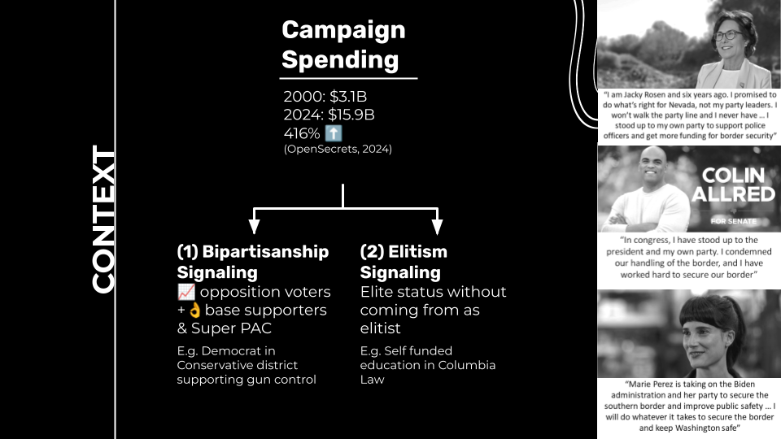
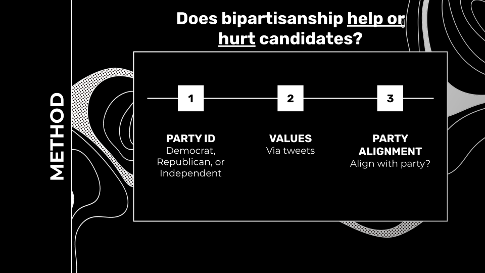
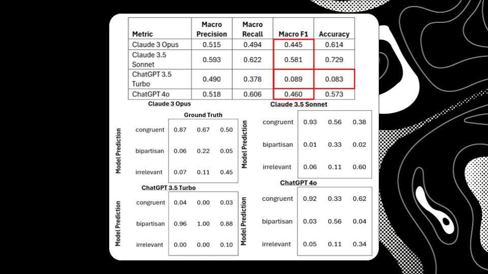
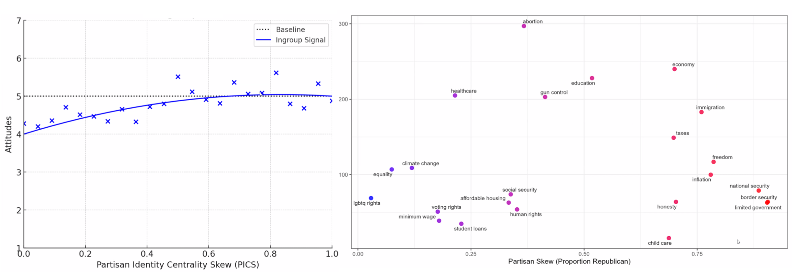
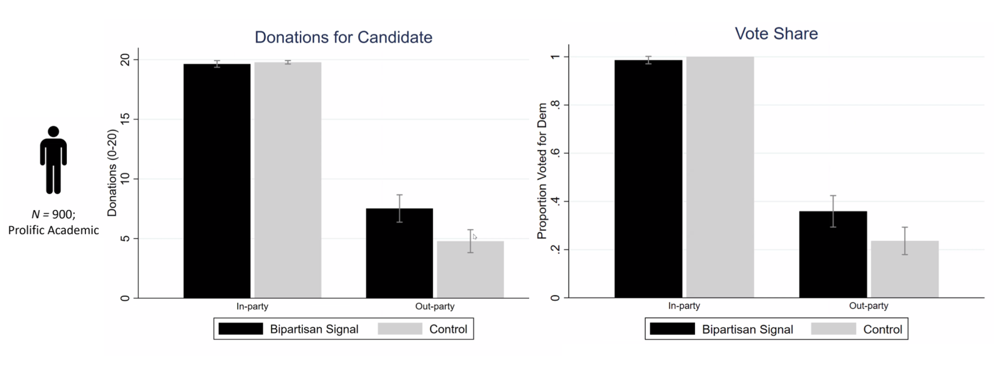

# Columbia Political Marketing Analysis

This repository contains two projects completed for Columbia Business School under the guidance of Professor Mohamed Hussein. Both projects examine how political candidates communicate key signals—either bipartisan or elitist—and how these signals may influence voter perceptions.

---

## Context: The Rising Cost of Campaigns

Campaign spending has quadrupled in recent years, making it critical to understand how to spend effectively. Understanding the impact of bipartisanship signaling and elitism signaling is crucial for modern political strategy.

  

---

## Part 1 — Identifying Bipartisan Signaling

The first project investigates whether political candidates express positions that diverge from their own party’s typical stance (e.g., a Democrat supporting gun rights or a Republican supporting universal healthcare).

### Research Question and Methodology

We sought to establish a ground truth labeling process for bipartisanship signaling to perform statistical analysis. Additionally, we aimed to test the effectiveness of Large Language Models (LLMs) in automating this labeling process.

  

### LLM Labeling Performance

We attempted to use LLMs to classify tweets into three categories:
- **0 — Congruent:** Aligns with party values
- **1 — Incongruent / Bipartisan signal:** Reflects views of the opposing party
- **2 — Irrelevant:** Non-political

#### Challenges with LLMs
Even cutting-edge models available at the time demonstrated a moderately high hallucination rate, particularly the larger models.

  

#### Labeling Results
Despite achieving decent accuracy, the models showed very limited Macro F1 scores. This suggests that while LLMs are promising, they still face challenges in nuanced political text analysis, contrary to some findings suggesting "GPT is an effective tool for multilingual psychological text analysis" (Steve Rathje).

  

### The Value of Bipartisanship

Our analysis revealed that certain voter topics are deemed controversial and contentious between parties. However, there are many topics that are important only to the in-group and not to opposition groups, and vice versa.

For example, a Democratic politician can appeal to "limited government," "limiting inflation," and "honesty" without turning away Democratic voters, as these topics might not be the primary focus of their base but appeal to the opposition.

  

### Impact on Voter Support

A survey of 900 people indicated that **bipartisanship does not seem to negatively affect in-party support**. In fact, it encourages out-party voters to donate money to opposition candidates when bipartisan signals are present. A similar positive effect was observed in vote share.

  

---

## Part 2 — Elite Credential Signaling

The second project examines whether candidates’ educational backgrounds function as “elite signals.” Candidates were labeled as *elite* if they attended a top-25 national university or a top-25 liberal arts college, based on data scraped from Wikipedia.

To determine whether candidates highlighted their elite credentials, we scraped their campaign websites to look for mentions of their educational background or school names. Because website structures varied widely—and many pages had irregular or inefficient HTML/CSS layouts—traditional structured scraping methods were unreliable. The most effective method was scanning the raw HTML for education-related keywords and known aliases of universities and colleges.
